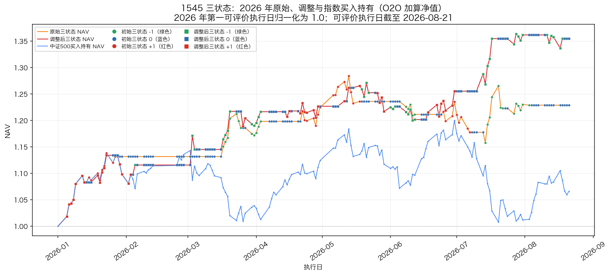

# 500三状态最终冻结｜最终汇报展示版

日期：2026-08-25

对应运行包：`20260825_1248_冻结中证500输出包`
汇报对象：中证500基础三状态、四个冻结反转信号及其持有期结果

## 核心结论

基础三状态可以作为中证500的长周期市场阶段基线；四个反转信号适合作为叠加在基础状态之上的快速补充层，而不是替代基础三状态。加入四个反转后，0 区间的方向覆盖明显增加，整体收益和风险指标改善。

2026 年识别更快有多视角同步、行情变化集中和滚动相对标准化共同参与，但当前结果不支持把改善归因于某一个单独因素。

## 数据与执行日口径

本次运行使用现货数据至 2026-08-24。最新输出行对应 2026-08-25 执行日，信号由 2026-08-24 收盘后计算得到；收益曲线的最后可评价执行日为 2026-08-21，因为 O2O 收益还需要下一实际交易日的开盘价。

| 日期层次 | 含义 |
|---|---|
| 形成日 `t` 收盘后 | 使用 `t` 及以前的现货数据计算三状态和反转信号 |
| 执行日 `t+1` | 输出表中的信号生效日，下一交易日上午开盘执行 |
| O2O 评价 | 使用执行日开盘到下一实际交易日开盘的收益 |

收益统一采用：`O2O = 下一实际交易日开盘 / 执行日开盘 - 1`，策略净值采用 `1 + cumsum(状态 × O2O)` 的加算口径，不使用复利。

## 问题的背景图

图中的红色区间主要对应基础三状态较长时间保持 0 的阶段。基础三状态要求多个视角达到一致并通过确认条件，因此低波动、方向分歧或尚未完成确认的行情会保留为 0。这个 0 表示“尚未达到正式方向状态”。

## 2023 年至最新的整体结果

上图将时间范围固定为 2023 年至最新可评价执行日，并统一使用执行日 O2O 加算口径，比较基础三状态、加入四个反转后的调整状态和中证500买入持有。加入反转后曲线的方向覆盖明显增加，说明反转层确实补充了基础 0 状态中的部分快速变化；同时，曲线并非所有区间都改善。

## 红色 0 区间的逐段复盘

| 区间 | 执行日范围 | 基础 0 → 调整后 0 | 转为方向的执行日 | 基础收益 | 调整后收益 | 指数收益 |
|---|---|---:|---:|---:|---:|---:|
| 红色区间一 | 2023-11-01—2024-01-15 | 34 → 21 | 13 | +1.95% | -2.61% | -6.26% |
| 红色区间二 | 2024-04-15—2024-09-13 | 82 → 59 | 26 | -1.13% | +10.05% | -16.23% |
| 红色区间三 | 2025-03-03—2025-07-15 | 64 → 45 | 19 | +4.07% | +17.58% | +3.14% |

三段区间的 0 状态占比分别下降约 24.5、21.7 和 20.7 个百分点。区间一中，新增的向上方向判断未能匹配后续 O2O，导致局部收益变差；区间二和区间三则显示出明显的方向补充效果。这一差异说明反转层已经解决“0 状态覆盖不足”的一部分问题，但仍应按阶段评价信号质量，不能用单一局部区间概括全部结果。

## 段持仓时间分布（按执行日期占比）

段持仓分布只纳入已经结束、可以完整评价的状态段；最新尚未结束的尾段保留在运行输出中，但不纳入历史分布统计。原始三状态共 146 个已闭合状态段、2081 个执行日；加入四个反转后共 482 个已闭合状态段、2095 个执行日。收益曲线仍统一截止到最后可评价执行日 2026-08-21。

| 持仓长度 | 原始执行日期占比 | 加入反转执行日期占比 |
|---|---:|---:|
| 1 日 | 0.0% | 3.5% |
| 2 日 | 1.0% | 10.9% |
| 3—5 日 | 6.9% | 33.4% |
| 6—10 日 | 17.1% | 31.5% |
| 11 日及以上 | 75.1% | 20.9% |

本表只按已闭合段覆盖的实际执行日期计算，不以段的数量作为比例分母。加入反转后，1—2 日持仓合计占执行日期 14.3%，3 日及以上持仓占 85.7%；因此短段出现得更频繁，按日期占比看，主要持仓仍由 3 日以上的连续段构成。

只看方向段（-1 与 +1），原始三状态有 73 段、639 个执行日，1—2 日方向段为 0；加入反转后有 255 段、1088 个执行日，其中 1—2 日方向段为 103 段、177 个执行日，占方向持仓日 16.3%，3 日以上方向持仓日仍占 83.7%。加入反转后的平均方向段长度为 4.27 日，中位数为 3 日；原始三状态平均为 8.75 日，中位数为 7 日。这正是快速补充层的作用：增加响应频率，同时牺牲一部分单段持续长度。

## 收益与风险结果

| 系列 | 累计收益 | 年化加算收益 | 年化波动 | Sharpe | 最大回撤 |
|---|---:|---:|---:|---:|---:|
| 原始三状态 | +143.76% | +17.29% | 15.05% | 1.15 | -11.70% |
| 加入四个反转 | +283.16% | +34.06% | 17.78% | 1.92 | -10.95% |
| 中证500买入持有 | +45.50% | +5.47% | 24.03% | 0.23 | -45.91% |

| 年份 | 慢快线差（日均） | 方向轴标准差（年内） | 原始三状态收益 | 加入四反转收益 | 指数收益 | 原始超额 | 调整后超额 |
|---:|---:|---:|---:|---:|---:|---:|---:|
| 2018 | -0.029 | 0.261 | -5.994% | +6.498% | -38.746% | +32.751% | +45.244% |
| 2019 | -0.024 | 0.267 | +44.067% | +71.376% | +26.477% | +17.590% | +44.899% |
| 2020 | +0.028 | 0.259 | +9.357% | +24.654% | +22.591% | -13.233% | +2.064% |
| 2021 | +0.053 | 0.239 | +6.590% | +9.827% | +15.897% | -9.308% | -6.070% |
| 2022 | -0.039 | 0.273 | +21.730% | +28.805% | -20.990% | +42.720% | +49.795% |
| 2023 | -0.074 | 0.259 | +6.642% | +4.483% | -6.532% | +13.174% | +11.015% |
| 2024 | +0.038 | 0.283 | +28.581% | +59.100% | +10.594% | +17.987% | +48.506% |
| 2025 | +0.056 | 0.252 | +9.906% | +42.934% | +29.607% | -19.701% | +13.327% |
| 2026 | +0.013 | 0.303 | +22.884% | +35.478% | +6.603% | +16.281% | +28.875% |

该表提取自原 17 图的年度收益和机制指标，删去了只用于辅助描述的市场类型标签；2018—2026 每一年都参与统计。之前 2018—2022 年显示“—”并不是没有计算收益，而是旧版只把 2023 年起的诊断切片接入了两列解释指标；本版已改为完整周期计算。

表内计算口径如下：

- **慢快线差（日均）**：先在形成日计算 `slow_engine - fast_engine`，再按其对应的下一实际执行日归入年份，最后对该年所有执行日做算术平均。正值表示慢引擎平均高于快引擎，负值表示快引擎平均高于慢引擎。它不是 60 日滚动均值；机制分析中的 `slow_fast_mean_60` 是另一个“先做 60 日滚动平均、再按年平均”的指标。
- **方向轴标准差（年内）**：将该年每个执行日对应形成日的 `rule_axis` 数值，按年计算样本标准差（`std(ddof=1)`）；数值越大表示方向轴在该年波动越分散，不等于收益波动率。
- **收益列**：按执行日 O2O 日收益逐日直接相加，不复利；原始超额 = 原始三状态收益 − 指数收益，调整后超额 = 加入四反转收益 − 指数收益。

净值、超额净值、调整相对原始收益和年度汇总共同说明：加入四个反转后，累计收益、Sharpe 和最大回撤均较原始三状态改善；同时波动、方向暴露和交易响应频率提高。当前结果未扣除交易成本，因此结论是“研究口径下的冻结结果具有较好的组合表现”，不是对实际净收益的承诺。

## 2026 年识别更快的机制解释

### 引擎内部状态诊断：2018 年至最新

这张图的横轴是形成日日期，底部状态颜色对应该形成日计算结果在下一实际执行日生效。图中从上到下各部分的含义是：

- **中证500收盘价**：展示研究标的本身的价格变化；
- **三条相对得分**：`rule_axis` 是正式方向轴，`slow_engine` 和 `fast_engine` 分别是冻结引擎的慢、快相对得分，用来观察方向判断和快慢响应的变化；
- **四个 `cv` 维度**：分别表示趋势、量价、位置和日内信息，用来观察不同信息视角是否同时变化；
- **基础三状态**：冻结的原始 `-1/0/+1` 状态；
- **调整后三状态**：叠加四个冻结反转信号后的最终 `-1/0/+1` 状态。

### 慢引擎—快引擎背离：2018 年至最新

慢引擎 `slow_engine =（趋势状态 + 量价状态）/2`，代表相对慢、较稳定的趋势与量价证据；快引擎 `fast_engine =（位置修复状态 + 跳空/日内承接状态）/2`，代表相对快、容易先变化的位置和短期承接证据。图中第一层是 `S-F Div = slow_engine - fast_engine`，横轴为形成日日期、纵轴为差值；第二层是 `rule_axis`，第三、四层分别是基础三状态和调整后三状态。

背离的读法是：

- **差值接近 0**：快、慢两组证据基本一致，方向判断更协调；
- **差值为负**：快引擎高于慢引擎，通常表示位置或短期承接先改善、但趋势和量价尚未确认，属于“快线先动”；
- **差值为正**：慢引擎高于快引擎，通常表示趋势和量价背景仍较强、但短期位置或日内承接偏弱，属于“快线先弱”；
- **差值持续扩大或穿越 0**：说明两组证据的时序差异变大；只有当它同时伴随 `rule_axis` 和正式状态按冻结确认规则切换时，才说明分歧已经传递到正式状态。

因此，快慢背离主要用来解释“短期反应”和“长期确认”为什么不同步：它能提示反弹尚未得到趋势量价确认，或提示长期背景尚在但短期出现回撤压力。它本身不是独立的买卖信号，不能仅凭差值正负改变三状态；正式状态仍由方向轴、多个视角、确认天数、最小驻留和滞回条件共同决定。

2026 年识别速度提高，当前证据支持以下联合解释：市场价格变化更集中，趋势、量价、位置修复和日内承接等视角在相近日期同步变化；滚动相对标准化使当前状态能够与近期市场环境比较；固定确认天数、最小驻留和滞回规则在满足条件后允许状态及时切换，同时过滤单一视角噪声。现有结果支持这一机制解释，但不能据此精确拆分每个因素的独立贡献。。

## 策略在哪些时间段赚钱

以下“赚钱”均指对应时间段的执行日 O2O 加算策略收益为正；“跑赢指数”则指策略收益高于同期中证500买入持有收益。原始三状态和加入四个反转分别列出，不能把两者混为一个结果。

### 按年度看

| 年份 | 原始三状态 | 加入四反转 | 指数收益 | 结果解读 |
|---:|---:|---:|---:|---|
| 2018 | -5.99% | +6.50% | -38.75% | 原始亏损；加入反转后转正，并显著防住指数下跌 |
| 2019 | +44.07% | +71.38% | +26.48% | 两者均赚钱，加入反转进一步增加收益 |
| 2020 | +9.36% | +24.65% | +22.59% | 两者均赚钱；原始低于指数，加入反转略高于指数 |
| 2021 | +6.59% | +9.83% | +15.90% | 两者绝对收益为正，但均未跑赢指数 |
| 2022 | +21.73% | +28.81% | -20.99% | 下跌环境中两者均赚钱，且明显跑赢指数 |
| 2023 | +6.64% | +4.48% | -6.53% | 两者均赚钱并跑赢指数，但反转层当年拖累原始结果 |
| 2024 | +28.58% | +59.10% | +10.59% | 两者均赚钱，加入反转的增益最明显之一 |
| 2025 | +9.91% | +42.93% | +29.61% | 两者均赚钱，加入反转显著改善原始结果并跑赢指数 |
| 2026* | +22.88% | +35.48% | +6.60% | 两者均赚钱，加入反转继续增加收益并跑赢指数 |

\* 2026 年统计截至最后可评价执行日 2026-08-21。

从市场环境看，策略更容易在方向切换较快、波动较高、或指数震荡下行而不是平滑单边上涨的区间取得较明显的绝对收益和超额收益：2018 年的下跌、2019 年的修复上涨、2022 年的下跌震荡，以及 2024—2026 年的高波动与快速切换，都属于已经观察到的有效阶段。相对而言，在持续、平滑的单边上涨阶段，策略即使取得正收益，也可能不及指数直接持有；反转层的增益也主要发生在短期方向变化集中、基础 0 状态较多的阶段，并非所有行情都同样有效。

### 按训练、验证和测试阶段看

- **训练期 2018—2022**：原始三状态在 2018 年亏损，但 2019—2022 年均赚钱；加入四反转后五年均为正，尤其 2019 年和 2022 年表现突出。也就是说，在 2026 年之前，策略已经在上涨、震荡和指数下跌环境中出现过有效结果。
- **验证期 2023—2024**：原始和调整结果两年均为正。2023 年反转层略有拖累，但仍跑赢下跌的指数；2024 年反转层将原始 +28.58% 提升至 +59.10%。
- **测试期 2025—2026**：原始和调整结果均连续为正，加入反转后的收益分别为 +42.93% 和 +35.48%，说明 2026 的表现不是只在训练期成立，也不是单年偶然现象。

### 2026 年单独视图

这张图把 2026 年单独展开，沿用全周期图的 O2O 加算口径，并将 2026 年第一可评价执行日归一化为 1.0：横轴为执行日，纵轴为 2026 年内的加算净值；橙线是原始三状态，红线是加入四个反转后的调整三状态，蓝线是中证500买入持有。圆点表示初始三状态，方点表示调整后三状态；点的颜色统一表示执行日状态，绿色为 -1、蓝色为 0、红色为 +1。图只画已经有下一实际交易日开盘价的可评价执行日，因此截至 2026-08-21；之后尚无下一开盘价的行保留在信号审计中，但不回填到收益曲线。

图上的点只落在实际交易日，不按周末和节假日补点；因此横轴按自然日期展开时，周末、节假日之间会出现空白区间。这些空白不代表 0 状态、缺失信号或收益被回填；本图的 154 个可评价交易日的净值和状态字段均完整，线段只是连接相邻实际交易日。

图中可以直接观察 2026 年各条策略净值的上行或回撤阶段，以及反转层相对原始三状态的增量；这张图用于看全年路径，不再拆成逐月文字表。

### 三个红色区间中原始与调整结果

- **2023-11-01—2024-01-15**：原始三状态 +1.95%，加入四反转 -2.61%。基础状态赚钱，但新增的方向响应没有匹配后续 O2O，反转层拖累结果。
- **2024-04-15—2024-09-13**：原始三状态 -1.13%，加入四反转 +10.05%。这是反转层把基础 0 区间转化为有效方向暴露的典型阶段。
- **2025-03-03—2025-07-15**：原始三状态 +4.07%，加入四反转 +17.58%。两者均赚钱，反转层进一步捕捉了快速方向变化。

### 2026 年之前已经出现过的有效行情

2026 年的行情和表现并非没有历史参照：2019 年加入反转后收益为 +71.38%，2022 年在指数下跌 -20.99% 时仍取得 +28.81%，2024 年在高波动阶段取得 +59.10%，2025 年在指数上涨背景下取得 +42.93%。因此更稳妥的结论是：2026 年的识别速度和收益表现延续了此前多个阶段已经验证过的能力；2026 年更快的切换是当前阶段的特征，不是策略首次赚钱的证据。
