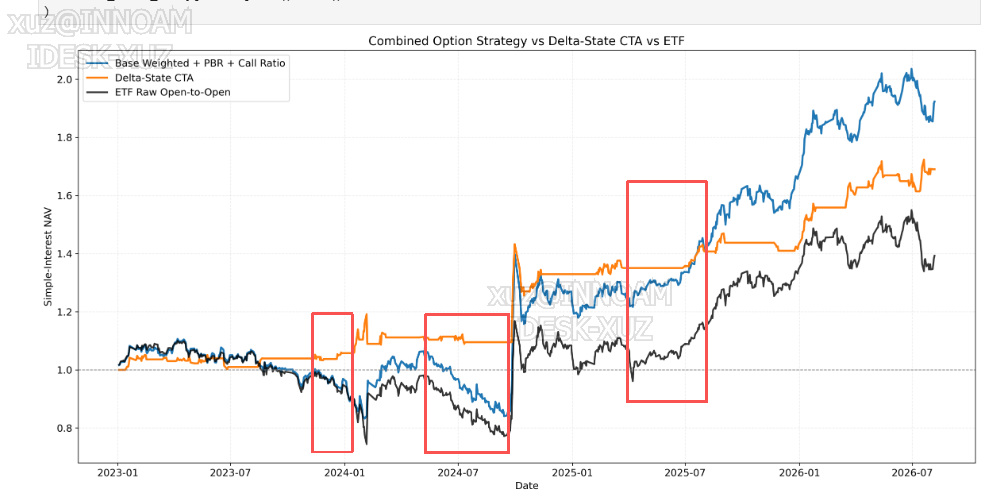
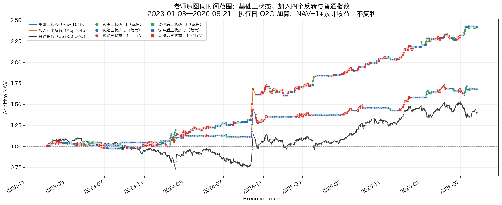
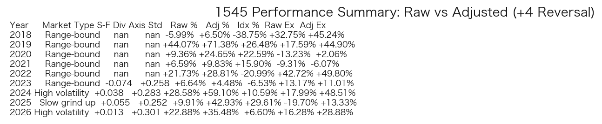
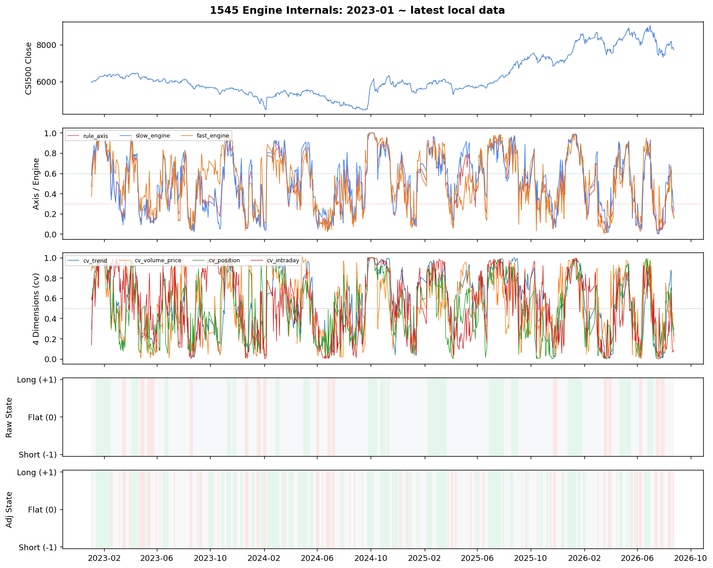
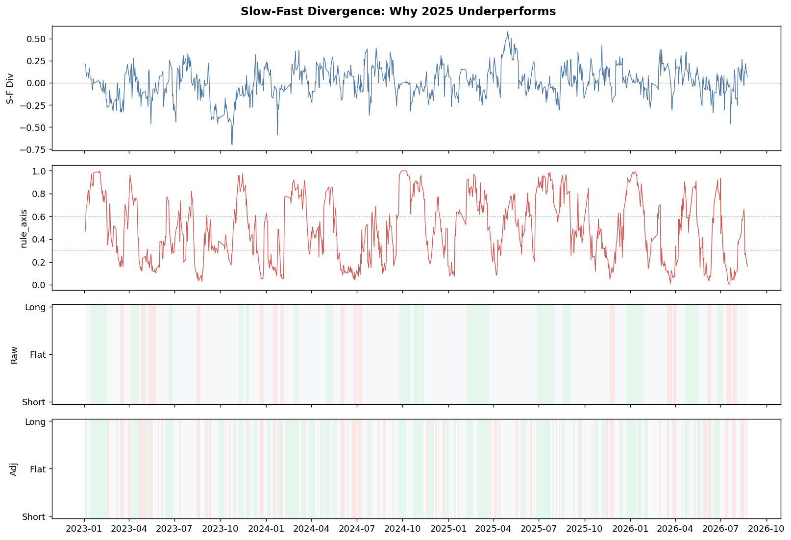
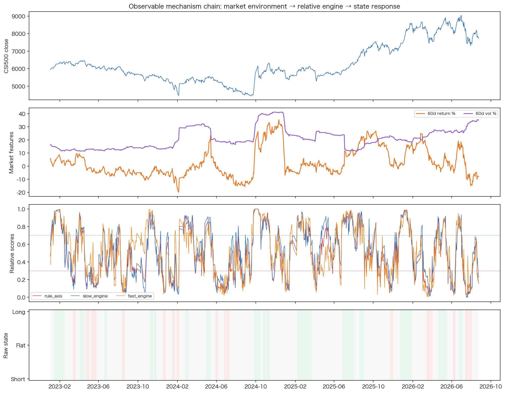
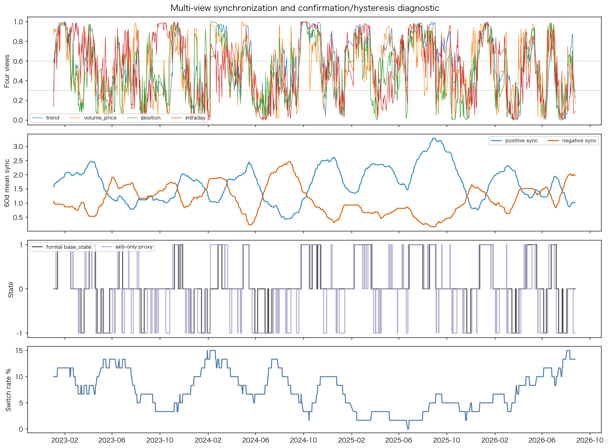

# 500三状态最终冻结｜最终汇报展示版

日期：2026-08-25

对应运行包：`20260825_1248_冻结中证500输出包`
汇报对象：中证500基础三状态、四个冻结反转信号及其持有期结果

## 核心结论

基础三状态可以作为中证500的长周期市场阶段基线；四个反转信号适合作为叠加在基础状态之上的快速补充层，而不是替代基础三状态。加入四个反转后，0 区间的方向覆盖明显增加，整体收益和风险指标改善，但短段数量也随之增加，因此应同时按“段数占比”和“执行日占比”评价，不能只看切换次数。

2026 年识别更快有多视角同步、行情变化集中和滚动相对标准化共同参与，但当前结果不支持把改善归因于某一个单独因素。

## 数据与执行日口径

本次运行使用现货数据至 2026-08-24。最新输出行对应 2026-08-25 执行日，信号由 2026-08-24 收盘后计算得到；收益曲线的最后可评价执行日为 2026-08-21，因为 O2O 收益还需要下一实际交易日的开盘价。

| 日期层次 | 含义 |
|---|---|
| 形成日 `t` 收盘后 | 使用 `t` 及以前的现货数据计算三状态和反转信号 |
| 执行日 `t+1` | 输出表中的信号生效日，下一交易日上午开盘执行 |
| O2O 评价 | 使用执行日开盘到下一实际交易日开盘的收益 |

收益统一采用：`O2O = 下一实际交易日开盘 / 执行日开盘 - 1`，策略净值采用 `1 + cumsum(状态 × O2O)` 的加算口径，不使用复利。

## 问题的背景图

图中的红色区间主要对应基础三状态较长时间保持 0 的阶段。基础三状态要求多个视角达到一致并通过确认条件，因此低波动、方向分歧或尚未完成确认的行情会保留为 0。这个 0 表示“尚未达到正式方向状态”。

## 2023 年至最新的整体结果

上图将时间范围固定为 2023 年至最新可评价执行日，并统一使用执行日 O2O 加算口径，比较基础三状态、加入四个反转后的调整状态和中证500买入持有。加入反转后曲线的方向覆盖明显增加，说明反转层确实补充了基础 0 状态中的部分快速变化；同时，曲线并非所有区间都改善。

## 红色 0 区间的逐段复盘

| 区间 | 执行日范围 | 基础 0 → 调整后 0 | 转为方向的执行日 | 基础收益 | 调整后收益 | 指数收益 |
|---|---|---:|---:|---:|---:|---:|
| 红色区间一 | 2023-11-01—2024-01-15 | 34 → 21 | 13 | +1.95% | -2.61% | -6.26% |
| 红色区间二 | 2024-04-15—2024-09-13 | 82 → 59 | 26 | -1.13% | +10.05% | -16.23% |
| 红色区间三 | 2025-03-03—2025-07-15 | 64 → 45 | 19 | +4.07% | +17.58% | +3.14% |

三段区间的 0 状态占比分别下降约 24.5、21.7 和 20.7 个百分点。区间一中，新增的向上方向判断未能匹配后续 O2O，导致局部收益变差；区间二和区间三则显示出明显的方向补充效果。这一差异说明反转层已经解决“0 状态覆盖不足”的一部分问题，但仍应按阶段评价信号质量，不能用单一局部区间概括全部结果。

## 段持仓时间分布

段持仓分布只纳入已经结束、可以完整评价的状态段；最新尚未结束的尾段保留在运行输出中，但不纳入历史分布统计。原始三状态共 146 个已闭合状态段、2081 个执行日；加入四个反转后共 482 个已闭合状态段、2095 个执行日。收益曲线仍统一截止到最后可评价执行日 2026-08-21。

| 持仓长度 | 原始段数占比 | 原始执行日占比 | 加入反转段数占比 | 加入反转执行日占比 |
|---|---:|---:|---:|---:|
| 1 日 | 0.0% | 0.0% | 15.1% | 3.5% |
| 2 日 | 6.8% | 1.0% | 23.6% | 10.9% |
| 3—5 日 | 20.5% | 6.9% | 36.9% | 33.4% |
| 6—10 日 | 32.2% | 17.1% | 18.5% | 31.5% |
| 11 日及以上 | 40.4% | 75.1% | 6.0% | 20.9% |

加入反转后，1—2 日短段合计占已闭合段数 38.6%，但只占执行日 14.3%；换言之，短段在段数上较多，在实际时间暴露上并未占主导，3 日及以上的段覆盖 85.7% 的执行日。因此当前结果不能说“完全不碎”，但按时间占比看，主要持仓仍由 3 日以上的连续段构成。

只看方向段（-1 与 +1），原始三状态有 73 段、639 个执行日，1—2 日方向段为 0；加入反转后有 255 段、1088 个执行日，其中 1—2 日方向段为 103 段、177 个执行日，占方向持仓日 16.3%，3 日以上方向持仓日仍占 83.7%。加入反转后的平均方向段长度为 4.27 日，中位数为 3 日；原始三状态平均为 8.75 日，中位数为 7 日。这正是快速补充层的作用：增加响应频率，同时牺牲一部分单段持续长度。

## 收益与风险结果

| 系列 | 累计收益 | 年化加算收益 | 年化波动 | Sharpe | 最大回撤 |
|---|---:|---:|---:|---:|---:|
| 原始三状态 | +143.76% | +17.29% | 15.05% | 1.15 | -11.70% |
| 加入四个反转 | +283.16% | +34.06% | 17.78% | 1.92 | -10.95% |
| 中证500买入持有 | +45.50% | +5.47% | 24.03% | 0.23 | -45.91% |

净值、超额净值、调整相对原始收益和年度汇总共同说明：加入四个反转后，累计收益、Sharpe 和最大回撤均较原始三状态改善；同时波动、方向暴露和交易响应频率提高。当前结果未扣除交易成本，因此结论是“研究口径下的冻结结果具有较好的组合表现”，不是对实际净收益的承诺。

## 2026 年识别更快的机制解释

2026 年识别速度提高，当前证据支持以下联合解释：市场价格变化更集中，趋势、量价、位置修复和日内承接等视角在相近日期同步变化；滚动相对标准化使当前状态能够与近期市场环境比较；固定确认天数、最小驻留和滞回规则在满足条件后允许状态及时切换，同时过滤单一视角噪声。现有结果支持这一机制解释，但不能据此精确拆分每个因素的独立贡献。

下面的 06 机制图将上述解释拆成历史相似性、同步性、标准化和后续表现证据；它们是解释图，不是新的冻结信号。

历史相似窗口按多项已经知道的特征构造，只用于回答当前市场结构过去是否出现过，不把相似窗口的未来收益当作生产信号。

这三张图共同说明，2026 年正式状态切换更快并不是简单放宽阈值，而是多个视角在相近时期同步变化后，通过确认和滞回规则完成切换；固定锚定曲线仅作机制对照，不属于生产逻辑。

历史相似阶段的后续收益存在正负差异，因此只能作为情景参考，不能作为下一阶段走势承诺。

年度收益与方向覆盖图显示，四个反转信号在基础三状态之外增加了方向暴露；该结果需要和持仓段分布、风险指标一起解读。

一致性审计图是技术复核证据，不改变研究结论；当前包的机器可读检查结果为 18/18 通过。

## 基础三状态与四个反转信号的研究定位

基础三状态是长周期阶段识别层，目标是给出相对稳定、可解释的 -1、0、+1 市场基线。四个反转信号是事件和快速响应层：其中 -1→0、+1→0 负责原方向退出，0→-1、0→+1 负责对基础 0 状态进行稀疏方向补充。含持有期输出用于检查事件触发后的连续持仓质量，不改变正式八列表的事件日结构。

四个信号的阈值和候选参数在 Development 阶段确定，Validation 用于独立质量检查，Test 阶段只在冻结后观察。当前结果适合定性为“基础三状态作为长周期基线，反转层作为可运行的快速补充”，不应表述为四个信号具有完全相同的预测强度。

## 最终审计结论

- 最新信号行由前一实际交易日收盘数据计算，执行日当天早上即可使用；没有回填和占位逻辑。
- 收益曲线只使用已经具备下一实际交易日开盘价的执行日，最新未成熟 O2O 行不会被虚填进净值。
- 当前运行包的 07 一致性检查为 `18/18` 张表通过，`success=true`；本地对照结果与包内远端运行结果在检查规则允许误差内一致。
- 形成日、执行日和 O2O 评价日分别处理，图表和表格均按同一口径生成。

## 可用于正式汇报的结论

中证500基础三状态已经可以作为长周期市场阶段基线；四个冻结反转信号在不改变基础三状态定义的前提下，提高了对红色 0 区间中快速方向变化的响应覆盖。加入反转后，短段数量增加，但从执行日占比看，1—2 日段并未占据主要时间，连续 3 日以上的持仓仍覆盖绝大多数实际暴露。2026 年识别更快主要由行情变化集中、多视角同步、滚动相对标准化和状态机确认机制共同解释。后续研究可在保持当前冻结结果不变的前提下，进一步开展严格一日执行口径的快速反应预测。
