# 500三状态最终冻结｜最终汇报展示版

日期：2026-08-25

对应运行包：`20260825_1248_冻结中证500输出包`
汇报对象：中证500基础三状态、四个冻结反转信号及其持有期结果

## 核心结论

基础三状态可以作为中证500的长周期市场阶段基线；四个反转信号适合作为叠加在基础状态之上的快速补充层，而不是替代基础三状态。加入四个反转后，0 区间的方向覆盖明显增加，整体收益和风险指标改善。

2026 年识别更快有多视角同步、行情变化集中和滚动相对标准化共同参与，但当前结果不支持把改善归因于某一个单独因素。

## 数据与执行日口径

本次运行使用现货数据至 2026-08-24。最新输出行对应 2026-08-25 执行日，信号由 2026-08-24 收盘后计算得到；收益曲线的最后可评价执行日为 2026-08-21，因为 O2O 收益还需要下一实际交易日的开盘价。

| 日期层次 | 含义 |
|---|---|
| 形成日 `t` 收盘后 | 使用 `t` 及以前的现货数据计算三状态和反转信号 |
| 执行日 `t+1` | 输出表中的信号生效日，下一交易日上午开盘执行 |
| O2O 评价 | 使用执行日开盘到下一实际交易日开盘的收益 |

收益统一采用：`O2O = 下一实际交易日开盘 / 执行日开盘 - 1`，策略净值采用 `1 + cumsum(状态 × O2O)` 的加算口径，不使用复利。

## 问题的背景图

图中的红色区间主要对应基础三状态较长时间保持 0 的阶段。基础三状态要求多个视角达到一致并通过确认条件，因此低波动、方向分歧或尚未完成确认的行情会保留为 0。这个 0 表示“尚未达到正式方向状态”。

## 2023 年至最新的整体结果

上图将时间范围固定为 2023 年至最新可评价执行日，并统一使用执行日 O2O 加算口径，比较基础三状态、加入四个反转后的调整状态和中证500买入持有。加入反转后曲线的方向覆盖明显增加，说明反转层确实补充了基础 0 状态中的部分快速变化；同时，曲线并非所有区间都改善。

## 红色 0 区间的逐段复盘

| 区间 | 执行日范围 | 基础 0 → 调整后 0 | 转为方向的执行日 | 基础收益 | 调整后收益 | 指数收益 |
|---|---|---:|---:|---:|---:|---:|
| 红色区间一 | 2023-11-01—2024-01-15 | 34 → 21 | 13 | +1.95% | -2.61% | -6.26% |
| 红色区间二 | 2024-04-15—2024-09-13 | 82 → 59 | 26 | -1.13% | +10.05% | -16.23% |
| 红色区间三 | 2025-03-03—2025-07-15 | 64 → 45 | 19 | +4.07% | +17.58% | +3.14% |

三段区间的 0 状态占比分别下降约 24.5、21.7 和 20.7 个百分点。区间一中，新增的向上方向判断未能匹配后续 O2O，导致局部收益变差；区间二和区间三则显示出明显的方向补充效果。这一差异说明反转层已经解决“0 状态覆盖不足”的一部分问题，但仍应按阶段评价信号质量，不能用单一局部区间概括全部结果。

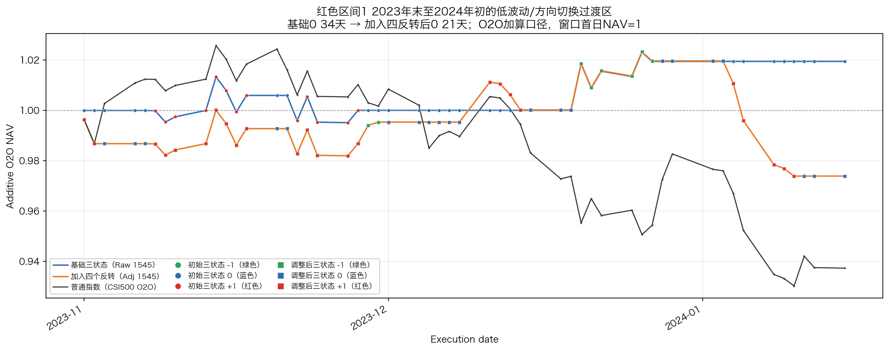

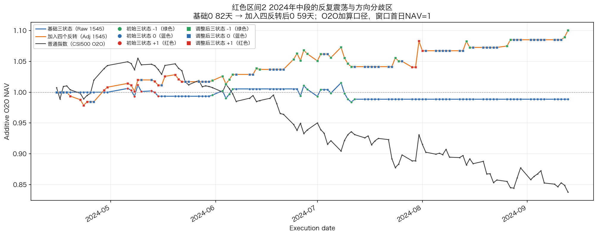

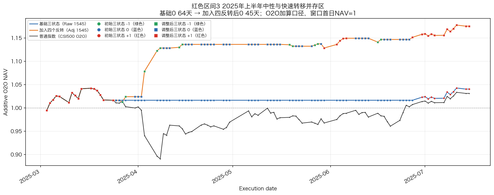

## 段持仓时间分布（按执行日期占比）

段持仓分布只纳入已经结束、可以完整评价的状态段；最新尚未结束的尾段保留在运行输出中，但不纳入历史分布统计。原始三状态共 146 个已闭合状态段、2081 个执行日；加入四个反转后共 482 个已闭合状态段、2095 个执行日。收益曲线仍统一截止到最后可评价执行日 2026-08-21。

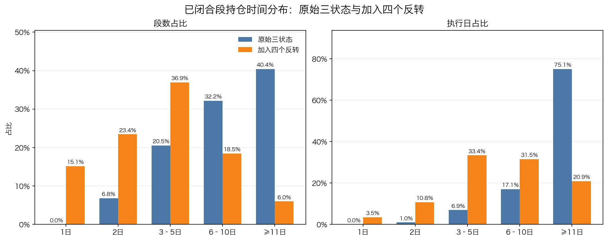

| 持仓长度 | 原始执行日期占比 | 加入反转执行日期占比 |
|---|---:|---:|
| 1 日 | 0.0% | 3.5% |
| 2 日 | 1.0% | 10.9% |
| 3—5 日 | 6.9% | 33.4% |
| 6—10 日 | 17.1% | 31.5% |
| 11 日及以上 | 75.1% | 20.9% |

本表只按已闭合段覆盖的实际执行日期计算，不以段的数量作为比例分母。加入反转后，1—2 日持仓合计占执行日期 14.3%，3 日及以上持仓占 85.7%；因此短段出现得更频繁，按日期占比看，主要持仓仍由 3 日以上的连续段构成。

只看方向段（-1 与 +1），原始三状态有 73 段、639 个执行日，1—2 日方向段为 0；加入反转后有 255 段、1088 个执行日，其中 1—2 日方向段为 103 段、177 个执行日，占方向持仓日 16.3%，3 日以上方向持仓日仍占 83.7%。加入反转后的平均方向段长度为 4.27 日，中位数为 3 日；原始三状态平均为 8.75 日，中位数为 7 日。这正是快速补充层的作用：增加响应频率，同时牺牲一部分单段持续长度。

## 收益与风险结果

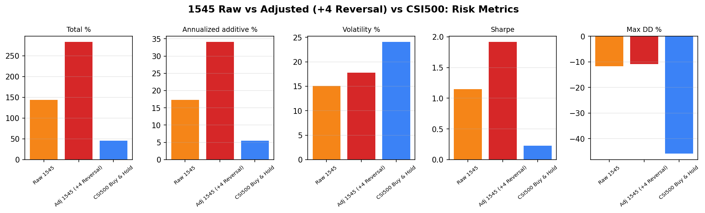

| 系列 | 累计收益 | 年化加算收益 | 年化波动 | Sharpe | 最大回撤 |
|---|---:|---:|---:|---:|---:|
| 原始三状态 | +143.76% | +17.29% | 15.05% | 1.15 | -11.70% |
| 加入四个反转 | +283.16% | +34.06% | 17.78% | 1.92 | -10.95% |
| 中证500买入持有 | +45.50% | +5.47% | 24.03% | 0.23 | -45.91% |

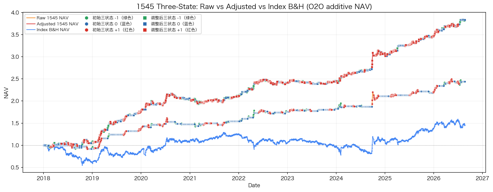

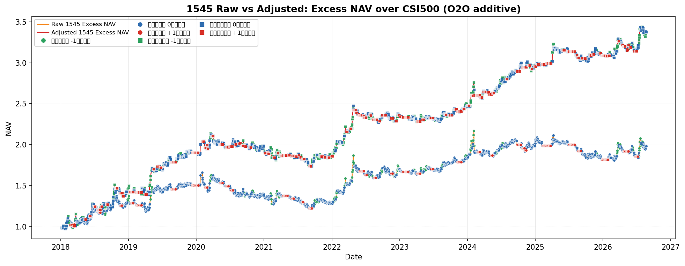

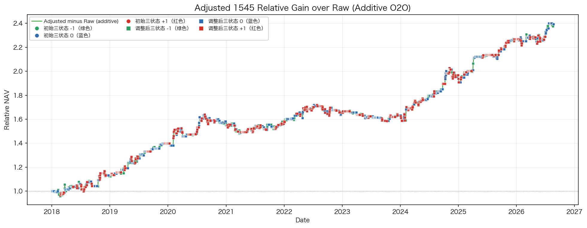

| 年份 | 慢快线差（日均） | 方向轴标准差（年内） | 原始三状态收益 | 加入四反转收益 | 指数收益 | 原始超额 | 调整后超额 |
|---:|---:|---:|---:|---:|---:|---:|---:|
| 2018 | -0.029 | 0.261 | -5.994% | +6.498% | -38.746% | +32.751% | +45.244% |
| 2019 | -0.024 | 0.267 | +44.067% | +71.376% | +26.477% | +17.590% | +44.899% |
| 2020 | +0.028 | 0.259 | +9.357% | +24.654% | +22.591% | -13.233% | +2.064% |
| 2021 | +0.053 | 0.239 | +6.590% | +9.827% | +15.897% | -9.308% | -6.070% |
| 2022 | -0.039 | 0.273 | +21.730% | +28.805% | -20.990% | +42.720% | +49.795% |
| 2023 | -0.074 | 0.259 | +6.642% | +4.483% | -6.532% | +13.174% | +11.015% |
| 2024 | +0.038 | 0.283 | +28.581% | +59.100% | +10.594% | +17.987% | +48.506% |
| 2025 | +0.056 | 0.252 | +9.906% | +42.934% | +29.607% | -19.701% | +13.327% |
| 2026 | +0.013 | 0.303 | +22.884% | +35.478% | +6.603% | +16.281% | +28.875% |

该表提取自原 17 图的年度收益和机制指标，删去了只用于辅助描述的市场类型标签；2018—2026 每一年都参与统计。之前 2018—2022 年显示“—”并不是没有计算收益，而是旧版只把 2023 年起的诊断切片接入了两列解释指标；本版已改为完整周期计算。

表内计算口径如下：

- **慢快线差（日均）**：先在形成日计算 `slow_engine - fast_engine`，再按其对应的下一实际执行日归入年份，最后对该年所有执行日做算术平均。正值表示慢引擎平均高于快引擎，负值表示快引擎平均高于慢引擎。它不是 60 日滚动均值；机制分析中的 `slow_fast_mean_60` 是另一个“先做 60 日滚动平均、再按年平均”的指标。
- **方向轴标准差（年内）**：将该年每个执行日对应形成日的 `rule_axis` 数值，按年计算样本标准差（`std(ddof=1)`）；数值越大表示方向轴在该年波动越分散，不等于收益波动率。
- **收益列**：按执行日 O2O 日收益逐日直接相加，不复利；原始超额 = 原始三状态收益 − 指数收益，调整后超额 = 加入四反转收益 − 指数收益。

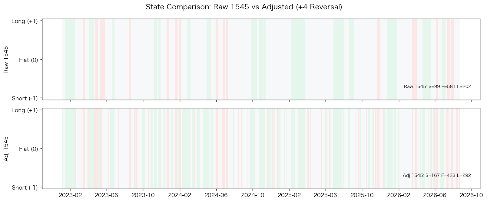

净值、超额净值、调整相对原始收益和年度汇总共同说明：加入四个反转后，累计收益、Sharpe 和最大回撤均较原始三状态改善；同时波动、方向暴露和交易响应频率提高。当前结果未扣除交易成本，因此结论是“研究口径下的冻结结果具有较好的组合表现”，不是对实际净收益的承诺。

## 2026 年识别更快的机制解释

### 引擎内部状态诊断：2018 年至最新

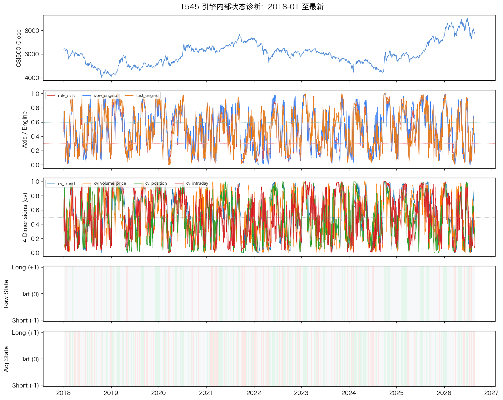

这张图的横轴是形成日日期，底部状态颜色对应该形成日计算结果在下一实际执行日生效。图中从上到下各部分的含义是：

- **中证500收盘价**：展示研究标的本身的价格变化；
- **三条相对得分**：`rule_axis` 是正式方向轴，`slow_engine` 和 `fast_engine` 分别是冻结引擎的慢、快相对得分，用来观察方向判断和快慢响应的变化；
- **四个 `cv` 维度**：分别表示趋势、量价、位置和日内信息，用来观察不同信息视角是否同时变化；
- **基础三状态**：冻结的原始 `-1/0/+1` 状态；
- **调整后三状态**：叠加四个冻结反转信号后的最终 `-1/0/+1` 状态。

**图示分析与结论：** 2018—2025 年的变化多数是局部维度或短暂波动，基础三状态通常保持较长的 0，只有在方向信息经过确认后才切换。2026 年多个维度在较短时间内同步变化，方向轴以及慢、快引擎的变化更容易连续传递到底部状态；调整后三状态在基础 0 区间增加了更及时的方向响应。因此，这张图支持“2026 年行情信息变化更集中、多个视角更同步，所以识别更快”的结论，同时也能看到确认规则仍在过滤短暂噪声。图中没有 60 日收益或 60 日波动曲线，这两项不属于本图的解释内容。

### 慢引擎—快引擎背离：2018 年至最新

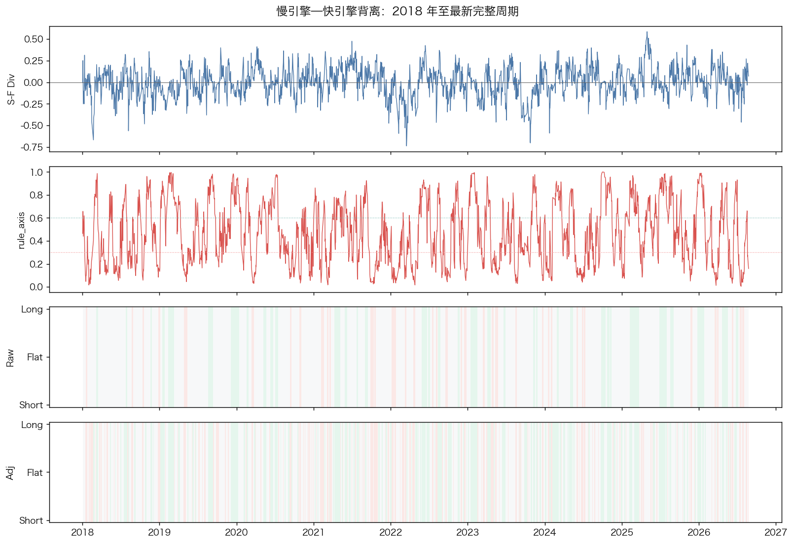

慢快线背离图的第一层是 `S-F Div = slow_engine - fast_engine`，横轴为日期、纵轴为差值；差值为正表示慢引擎相对更高，差值为负表示快引擎相对更高。第二层是 rule_axis，第三、四层分别是基础和调整后三状态。读图时看背离是否伴随方向轴变化，以及正式状态是否只在确认后切换；背离可以解释快反应与慢确认的时序差异，但本身不是独立交易信号。

2026 年识别速度提高，当前证据支持以下联合解释：市场价格变化更集中，趋势、量价、位置修复和日内承接等视角在相近日期同步变化；滚动相对标准化使当前状态能够与近期市场环境比较；固定确认天数、最小驻留和滞回规则在满足条件后允许状态及时切换，同时过滤单一视角噪声。现有结果支持这一机制解释，但不能据此精确拆分每个因素的独立贡献。

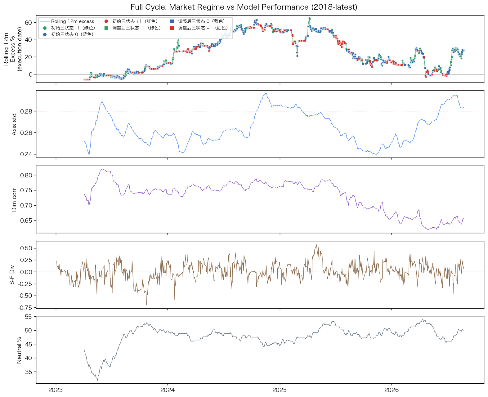

这张全周期图把机制指标与表现放在同一时间轴上：第一层是滚动 12 个月调整策略相对指数的超额加算收益，第二层是 252 日方向轴标准差，第三层是四维度相关性，第四层是慢快线差，第五层是 252 日中性占比。滚动超额收益按 252 个执行日的“调整策略日收益−指数日收益”直接求和；其余层分别用滚动标准差、相关系数、均值差和中性日比例计算。读图时看 2026 的表现是否与波动、同步性、慢快线和中性占比同时变化，而不是把某一条曲线当作单独因果证明。

下面的机制图将上述解释拆成历史相似性、同步性、标准化和后续表现证据；它们是解释图，不是新的冻结信号。除问题图、2023 年至最新整体结果和三个红色 0 区间复盘外，以下机制分析图均使用 2018 年至最新的完整周期。

### 机制图的统一读图口径

机制图的横轴都是日期或年度，纵轴是图中标出的指标；形成日指标只使用当日及以前可见的数据，状态背景对应下一实际执行日。机制图用于解释冻结结果，不参与阈值选择、信号生成或回填。

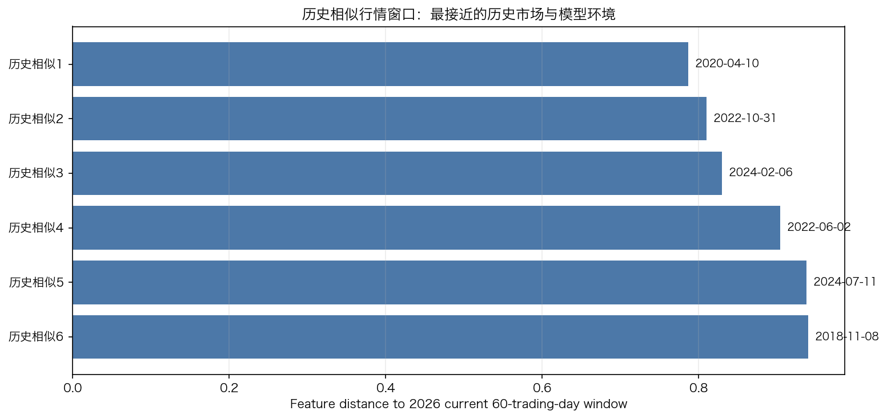

距离图的横轴是与当前 60 交易日窗口的标准化特征距离，纵轴是历史候选窗口，柱越短越相似。距离按 `sqrt(mean(((候选特征−当前特征)/历史标准差)^2))` 计算，特征包括 20/60/120 日收益、波动、回撤、振幅、跳空，以及方向轴、慢快线、多视角同步、中性占比和切换率。它用于结构相似度判断，不是收益预测。

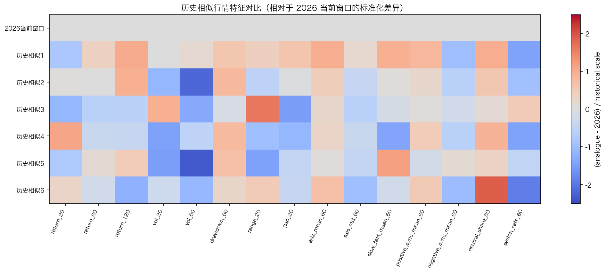

热图横轴是特征、纵轴是当前窗口或历史候选窗口，颜色是 `z=(候选特征−当前特征)/历史标准差`；接近 0 表示接近当前，正值表示候选更高，负值表示候选更低。读图要看整行颜色组合，而不是只看一格；后续收益不参与相似窗口排序。

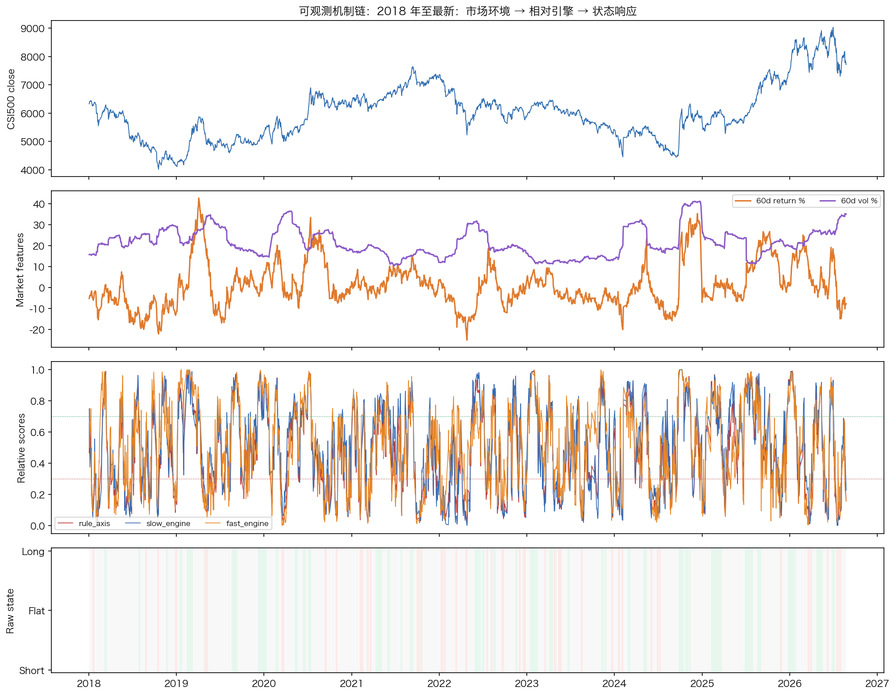

行情与模型相对状态图从上到下看收盘价、60 日收益与波动、rule_axis/slow_engine/fast_engine 和基础状态。60 日收益为 `close[t]/close[t-60]-1`，60 日波动为日收盘收益标准差乘 `sqrt(252)`；横轴是日期，纵轴按层分别是价格、收益/波动、相对分数和 -1/0/+1 状态。结论是 2026 的切换更密集与市场变化集中、多项得分同步变化相符。

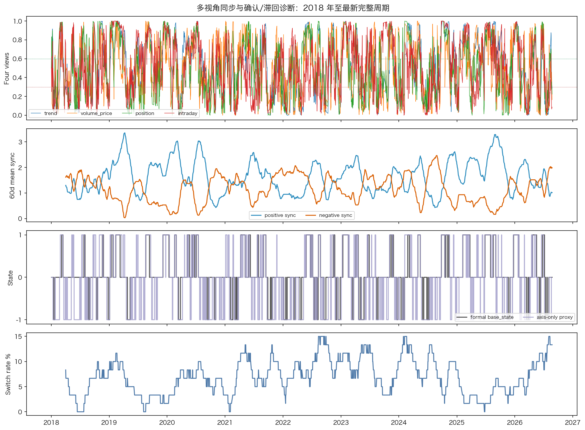

多视角同步图第一层是四个 cv 维度，0.60 以上为正向区域、0.30 以下为负向区域；第二层是四个维度在 60 日窗口内达到正/负区域的平均数量；第三层比较正式 `base_state` 与只看方向轴的代理；第四层是 60 日状态切换率。横轴是日期，纵轴依次是维度值、同步数量、状态和百分比。正式切换少于单轴代理，说明确认、最小驻留和滞回在过滤单一视角噪声。

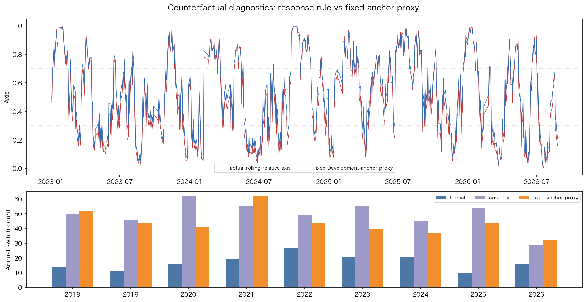

标准化对照图上半部分横轴是日期、纵轴是方向轴：红线为正式滚动相对 rule_axis，蓝线为固定 Development 锚定代理。固定代理把 2018—2022 开发期四个维度转换为经验分位数，再按 0.40/0.30/0.15/0.15 加权，≤0.30 判 -1、≥0.70 判 +1，其余为 0；下半部分横轴为年份、纵轴为年度切换次数。固定代理只用于反事实诊断，不替代冻结生产逻辑。结论是滚动相对比较能随环境变化，正式状态仍比代理更保守。

这三张图共同说明，2026 年正式状态切换更快并不是简单放宽阈值，而是多个视角在相近时期同步变化后，通过确认和滞回规则完成切换；固定锚定曲线仅作机制对照，不属于生产逻辑。

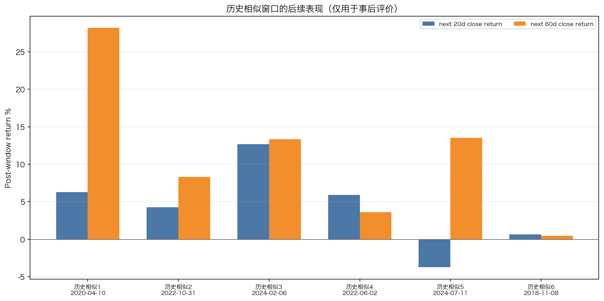

历史相似阶段的后续收益存在正负差异，因此只能作为情景参考，不能作为下一阶段走势承诺。

后续表现图横轴是历史相似窗口及其结束日期，纵轴是窗口结束后未来 20/60 个交易日的收盘收益，计算为 `close[t+h]/close[t]-1`。它不是执行日 O2O，不参与相似窗口排名或信号生成。

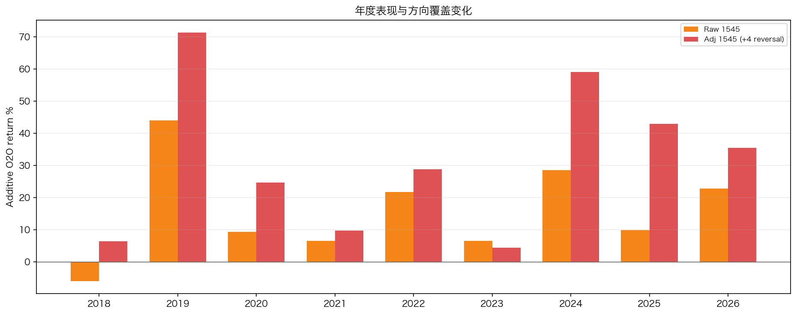

年度收益与方向覆盖图显示，四个反转信号在基础三状态之外增加了方向暴露；该结果需要和持仓段分布、风险指标一起解读。

年度图横轴为年份，纵轴为年度 O2O 加算收益百分比；橙柱为原始三状态，红柱为加入四个反转。年度收益等于该年各执行日策略收益直接求和，不复利；方向覆盖天数要结合年度表的 `adjusted_directional_days` 读取，不能从柱高推断。

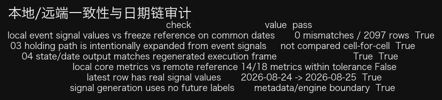

一致性审计图是技术复核证据，不改变研究结论；当前包的机器可读检查结果为 18/18 通过。

一致性审计图是技术审计表，不是新的信号图。横向查看 `status`、远端/本地行数、列名、差异单元格和差异行数：`PASS` 表示按规则一致，`VALUE_MISMATCH` 表示连续诊断值存在差异。应先看事件信号、日期链和执行日输出，再单独看连续诊断值；当前包的 07 严格一致性检查为 18/18 通过。

## 基础三状态与四个反转信号的研究定位

基础三状态是长周期阶段识别层，目标是给出相对稳定、可解释的 -1、0、+1 市场基线。四个反转信号是事件和快速响应层：其中 -1→0、+1→0 负责原方向退出，0→-1、0→+1 负责对基础 0 状态进行稀疏方向补充。含持有期输出用于检查事件触发后的连续持仓质量，不改变正式八列表的事件日结构。

四个信号的阈值和候选参数在 Development 阶段确定，Validation 用于独立质量检查，Test 阶段只在冻结后观察。当前结果适合定性为“基础三状态作为长周期基线，反转层作为可运行的快速补充”，不应表述为四个信号具有完全相同的预测强度。

## 最终审计结论

- 最新信号行由前一实际交易日收盘数据计算，执行日当天早上即可使用；没有回填和占位逻辑。
- 收益曲线只使用已经具备下一实际交易日开盘价的执行日，最新未成熟 O2O 行不会被虚填进净值。
- 当前运行包的 07 一致性检查为 `18/18` 张表通过，`success=true`；本地对照结果与包内远端运行结果在检查规则允许误差内一致。
- 形成日、执行日和 O2O 评价日分别处理，图表和表格均按同一口径生成。

## 可用于正式汇报的结论

中证500基础三状态已经可以作为长周期市场阶段基线；四个冻结反转信号在不改变基础三状态定义的前提下，提高了对红色 0 区间中快速方向变化的响应覆盖。加入反转后，短段数量增加，但从执行日占比看，1—2 日段并未占据主要时间，连续 3 日以上的持仓仍覆盖绝大多数实际暴露。2026 年识别更快主要由行情变化集中、多视角同步、滚动相对标准化和状态机确认机制共同解释。后续研究可在保持当前冻结结果不变的前提下，进一步开展严格一日执行口径的快速反应预测。
